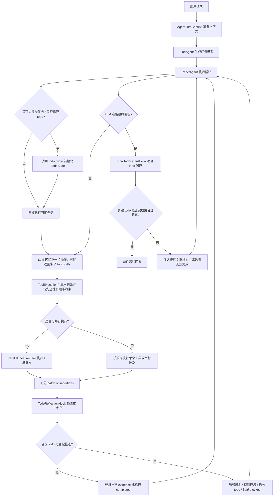
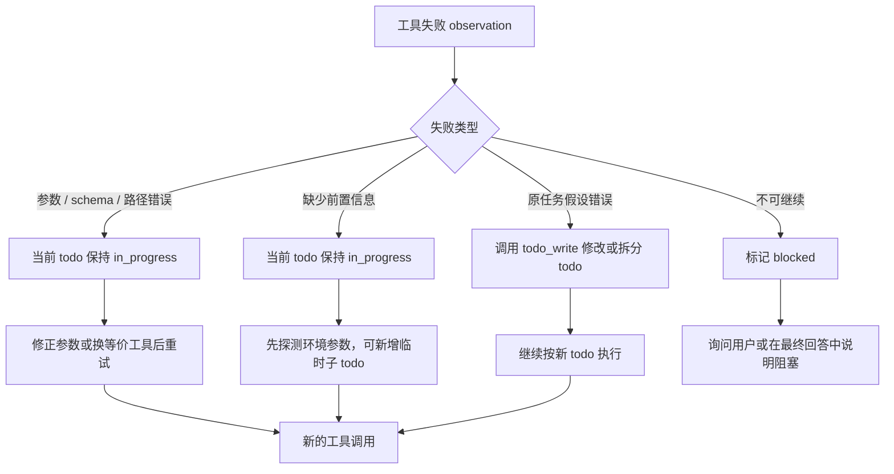
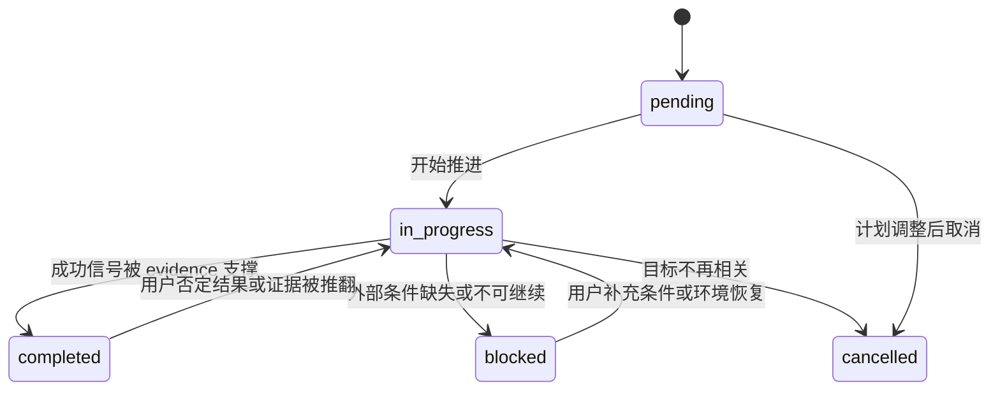
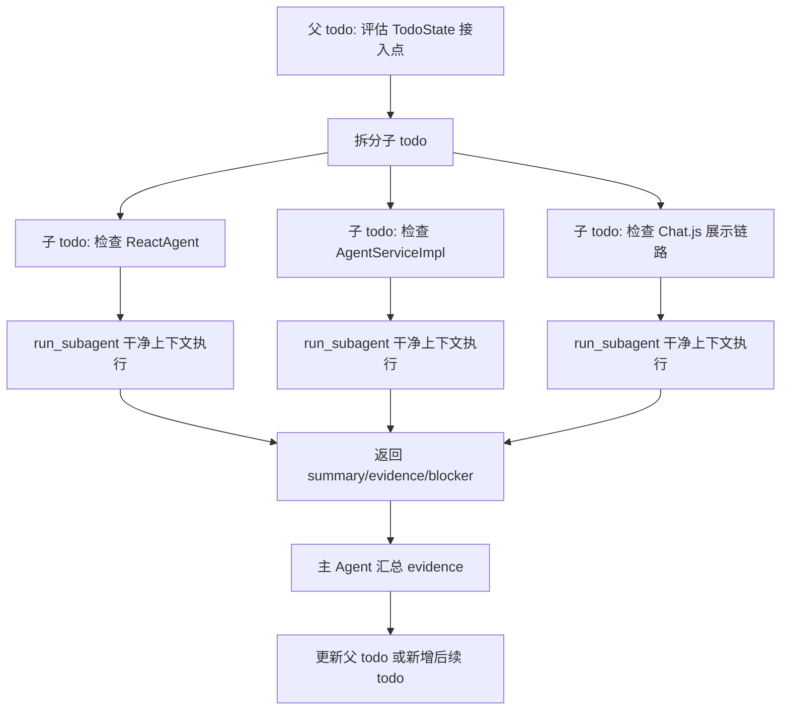

# Agent TodoWrite 与步骤反思机制设计计划

## 1. 背景

当前 WebAgent 已经具备 `PlanAgent -> ReactAgent -> Tool -> Observation` 的基础链路。`PlanAgent` 会输出目标状态、当前判断、成功信号和初始策略，`ReactAgent` 再把这段计划作为任务策略注入执行器提示词。

这个设计能让执行器知道方向，但计划本身偏软：

- 计划是一段文本，不是运行时状态。
- 执行过程中没有明确记录“当前正在推进哪一步”。
- 工具调用成功不等于任务成功，但现有链路没有强制做完成度校验。
- 失败后的转向主要依赖模型自觉，没有结构化记录“为什么转向、转向是否仍服务于目标”。

本计划希望引入一个会话内的 `TodoWrite` 风格运行时计划机制，让任务计划从“提示词里的建议”升级为“可检查、可更新、可展示的任务状态”。

更准确地说，`TodoWrite` 不是调度器，而是看板和账本。用户目标与 `PlanAgent` 的任务模型给 `ReactAgent` 指方向；`TodoState` 把这个方向拆成可验收的目标项、成功信号和证据；`ReactAgent` 才负责根据 observation 选择下一步、调用工具、派发子代理或执行并行工具批次。

## 2. 目标

目标不是把 Agent 变成死板流程机，而是让它具备更稳定的在线反思能力：

- 多步任务有结构化 todo 清单。
- 每个 todo 有状态、成功信号和完成证据。
- 工具失败时允许局部修复、探测环境、换等价工具。
- 发现原假设错误时，必须显式更新 todo，而不是静默偏航。
- 最终回答前检查 todo 是否闭环，避免“过程看起来成功但任务没完成”。

一句话原则：

> 目标和证据要硬，执行路径要软。

## 3. 非目标

第一阶段不做完整任务系统：

- 不跨会话持久化 todo。
- `TodoState` 不做文件锁、依赖图和并发调度；并行调度属于 `ReactAgent`、`ToolExecutionPolicy` 和 `ParallelToolExecutor`。
- 不要求每次微小工具调用都对应一个 todo。
- 不把 `PlanAgent` 删除或替换。
- 不做复杂搜索树或 LATS。
- 不把所有失败都标记为 blocked。

第一阶段只做当前会话当前轮的轻量运行时计划。

## 4. 运行后的用户体验

用户发起一个多步任务：

```text
调研这个项目里的 agent 反思机制，并给出改造方案。
```

理想运行过程如下：

```text
计划
- 目标状态：给出结合当前项目结构的 agent 反思机制改造方案
- 成功信号：说明现有链路、指出缺口、给出分阶段改造路径

任务清单
○ 读取当前 Agent 编排结构
○ 分析 PlanAgent 与 ReactAgent 的关系
○ 对比主流 Reflection / TodoWrite 机制
○ 设计 TodoState + Reflection Hook
○ 整理改造阶段和风险
```

执行过程中状态会更新：

```text
✓ 读取当前 Agent 编排结构
✓ 分析 PlanAgent 与 ReactAgent 的关系
→ 设计 TodoState + Reflection Hook
○ 整理改造阶段和风险
```

如果某个工具失败，例如参数不合法：

```text
正在分析 Hook 接入点...
工具调用参数不符合要求，调整参数后重试。
```

此时当前 todo 仍保持 `in_progress`，不会立刻变成 `blocked`。只有当发现缺权限、缺用户确认、外部信息不可获得或原任务假设错误时，才更新 todo 为 `blocked` 或重写计划。

## 5. 核心设计原则

### 5.0 Todo 是看板，不是执行器

可以把边界理解成一句话：

> `TodoWrite` 提供硬一点的任务看板，`ReactAgent` 看着看板和 observation 往前走。

各组件的职责应保持分离：

| 组件 | 职责 | 不负责 |
| --- | --- | --- |
| `PlanAgent` | 任务前建模，给出目标状态、成功信号和初始策略 | 不维护运行时状态 |
| `ReactAgent` | 推进任务，选择工具，决定是否需要并行工具批次或子代理 | 不把计划状态藏在自然语言里 |
| `ToolExecutionPolicy` | 判断工具调用能否并行、安全风险和顺序约束 | 不修改 todo |
| `ParallelToolExecutor` | 执行通过策略校验的并行工具批次，并汇总 observation | 不判断任务是否完成 |
| `TodoState` | 记录 todo、状态、成功信号、证据、阻塞原因和并行批次引用 | 不调度工具、不执行工具 |
| `TodoWriteTool` | 让 `ReactAgent` 显式更新看板 | 不选择下一步动作 |

所以它不是“Todo 给工具排队”，而是“Todo 让 `ReactAgent` 每次行动都有一个可检查的目标锚点”。并行能力越强，这个边界越重要：并发由执行循环处理，Todo 只记录哪一批结果服务于哪个目标。

### 5.1 Todo 管目标，不管微动作

好的 todo：

```text
确认远端分支是否可以合并
```

不好的 todo：

```text
调用 git merge-base 命令
```

前者允许 Agent 通过 `git status`、`git log`、`git merge-base` 等不同工具路线达成目标；后者会把执行路径写死。

### 5.2 完成必须有证据

todo 不能只因为模型认为完成就标记 `completed`。每个关键 todo 至少应有一条来自工具 observation、环境状态、用户确认或可验证输出的 evidence。

示例：

```json
{
  "id": "check-git-state",
  "title": "确认当前 Git 状态",
  "status": "completed",
  "successSignals": [
    "确认当前分支",
    "确认本地与远端差异"
  ],
  "evidence": [
    "git status 显示 main...origin/main [ahead 7]"
  ]
}
```

### 5.3 转向必须说明关系

Agent 可以换工具、先探测环境、拆分子目标、修改计划，但需要满足一个条件：

> 新动作必须说明它仍在推进哪个 todo，或者显式更新 todo。

这样允许灵活转向，同时避免任务漂移。

### 5.4 失败分级处理

工具失败不等于任务失败。失败应先分级：

| 类型 | 含义 | 对 todo 的影响 |
| --- | --- | --- |
| `transient_error` | 超时、网络抖动、临时失败 | 当前 todo 保持 `in_progress`，允许重试 |
| `tool_argument_error` | 参数、schema、路径不匹配 | 当前 todo 保持 `in_progress`，修正调用方式 |
| `environment_gap` | 缺少环境参数或前置信息 | 当前 todo 保持 `in_progress`，可新增探测子 todo |
| `task_assumption_wrong` | 原计划假设被 observation 推翻 | 调用 `todo_write` 修改、拆分或重排 todo |
| `hard_blocked` | 缺权限、缺用户确认、外部条件不可满足 | 标记 `blocked` 并说明需要用户决定什么 |

## 6. 总体流程



## 7. 工具失败时的局部修复流程



这个流程保证 Agent 不会因为一次工具参数错误就被 todo 卡死，也不会因为频繁转向而忘记原目标。

## 8. Todo 状态机



状态含义：

| 状态 | 含义 |
| --- | --- |
| `pending` | 已列入计划，尚未开始 |
| `in_progress` | 当前正在推进 |
| `completed` | 已有 evidence 支撑完成 |
| `blocked` | 需要用户、权限、外部环境或更多信息 |
| `cancelled` | 因计划调整而不再需要 |

## 9. 核心数据结构设想

### 9.1 AgentTodoState

```json
{
  "sessionId": "session-1",
  "turnId": "turn-1",
  "sourcePlan": "PlanAgent 产出的任务模型摘要",
  "items": [],
  "batches": [],
  "updatedAt": 1782892800000
}
```

### 9.2 AgentTodoItem

```json
{
  "id": "check-agent-loop",
  "title": "确认 ReactAgent 执行循环",
  "status": "in_progress",
  "successSignals": [
    "确认工具调用进入 observation",
    "确认 observation 会进入下一轮 LLM"
  ],
  "evidence": [],
  "blocker": null,
  "attempts": [
    {
      "tool": "search_graph",
      "status": "failed",
      "reason": "索引未覆盖新增文件",
      "next": "改用文件读取交叉确认"
    }
  ]
}
```

`attempts` 是诊断信息，不一定完整展示给用户。用户界面优先展示 todo 状态、证据和阻塞原因。

### 9.3 AgentParallelBatch

并行批次是 `ReactAgent` 的执行记录，不是 `TodoState` 的调度指令。`TodoState` 只保存批次引用，方便前端展示和后续 evidence 校验。

```json
{
  "batchId": "batch-1",
  "parentTodoId": "research-deepseek-parallel",
  "status": "completed",
  "createdBy": "ReactAgent",
  "executionMode": "native_tool_calls",
  "toolCallIds": ["call-1", "call-2", "call-3"],
  "summary": "并行检索 DeepSeek 文档、项目实现和前端展示链路",
  "evidenceCandidates": [
    "DeepSeek 文档确认支持 parallel tool calls",
    "BaseLlmServiceImpl 当前只消费第一个 tool call"
  ]
}
```

字段约束：

- `parentTodoId` 指明这批工具结果服务于哪个 todo。
- `executionMode` 可取 `native_tool_calls`、`background_subagents` 或 `serial_fallback`。
- `evidenceCandidates` 只是候选证据，必须由 `ReactAgent` 或 `TodoReflectionHook` 对照 `successSignals` 后才能写入 todo 的正式 `evidence`。
- 批次状态可以是 `running`、`completed`、`partial`、`failed` 或 `cancelled`。

## 10. todo_write 工具协议

`todo_write` 是一个计划状态工具，不执行任何业务动作。

输入：

```json
{
  "todos": [
    {
      "id": "read-agent-structure",
      "title": "读取当前 Agent 编排结构",
      "status": "completed",
      "successSignals": [
        "找到编排入口",
        "找到执行循环"
      ],
      "evidence": [
        "AgentServiceImpl 调用 ReactAgentFactory 创建执行器",
        "ReactAgent.runStream 包含 tool_call -> observation 循环"
      ]
    },
    {
      "id": "design-reflection-hooks",
      "title": "设计步骤反思 Hook",
      "status": "in_progress",
      "successSignals": [
        "明确触发条件",
        "明确 StopHook 和 PostToolUseHook 接入点"
      ]
    }
  ]
}
```

输出：

```text
TodoState 已更新：2 项，1 completed，1 in_progress。
当前进行中：设计步骤反思 Hook。
```

校验规则：

- `id` 必须稳定，不能每次重写都换 ID。
- 同一时间建议只有一个主 `in_progress` todo。
- `completed` 建议包含 evidence；缺少 evidence 时返回提醒，但第一版可不强制失败。
- `blocked` 必须包含 blocker。
- 允许新增、拆分、取消 todo，但需要保留原因。

## 11. Todo 更新与计划重写限制

`todo_write` 不能变成模型随意改写目标的出口。它要允许执行过程中的正常调整，但必须限制静默删除、降低验收标准和频繁重写计划。

本设计把变更分成三类：

| 变更类型 | 含义 | 是否消耗重写预算 | 典型场景 |
| --- | --- | --- | --- |
| `status_update` | 状态推进或补充证据 | 否 | `pending -> in_progress`、补 evidence、标记 completed |
| `minor_rewrite` | 小范围调整计划 | 轻量计数 | 新增前置探测 todo、拆分当前 todo、补充成功信号 |
| `major_rewrite` | 改变主路线或验收结构 | 是 | 取消多个关键 todo、替换主要路径、重写成功信号 |

### 11.1 状态更新规则

状态更新应该轻量，允许频繁发生，但必须满足以下规则：

- 同一时间最多一个主 `in_progress` todo；子 todo 可以作为当前主 todo 的前置探测存在。
- `completed` 必须有 evidence；第一版可以先返回提醒，后续应逐步收紧为强校验。
- `blocked` 必须有 blocker，并说明需要用户、权限、环境还是外部信息。
- `cancelled` 必须有 reason，不能静默删除。
- todo 的 `id` 必须稳定；更新状态时不要换新 ID。
- 不允许删除未完成 todo，只能改为 `cancelled` 并写明原因。
- 不允许把用户明确要求的目标静默取消。

正常状态更新示例：

```json
{
  "changeType": "status_update",
  "todos": [
    {
      "id": "check-hook-entry",
      "title": "确认 Hook 接入点",
      "status": "completed",
      "successSignals": [
        "找到 Hook 注册位置",
        "确认可复用的 Hook 类型"
      ],
      "evidence": [
        "ReactAgentHookService.configureForStream 注册了 PreToolUseHook 和 PostToolUseHook"
      ]
    }
  ]
}
```

不合格状态更新示例：

```json
{
  "changeType": "status_update",
  "todos": [
    {
      "id": "check-hook-entry",
      "title": "确认 Hook 接入点",
      "status": "completed",
      "evidence": []
    }
  ]
}
```

### 11.2 局部工具失败不等于计划重写

工具参数错误、路径错误、schema 不匹配等小失败，默认只属于 ReAct 循环的局部修复，不触发正式反思，也不需要更新 todo。

推荐处理：

```text
工具参数错误
  -> observation 返回给 ReactAgent
  -> ReactAgent 修正参数或先探测环境
  -> 当前 todo 保持 in_progress
  -> 不调用 todo_write
```

只有出现以下情况时，才需要反思 Hook 或 todo 更新介入：

- 同一种错误连续出现多次。
- 工具失败说明原计划假设不成立。
- 修正参数需要先完成新的前置探测。
- Agent 开始换方向，但新方向和当前 todo 的关系不清楚。
- Agent 准备跳过当前 todo 或直接最终回答。

### 11.3 计划重写触发条件

计划重写比状态更新严格。只有以下情况允许触发 `minor_rewrite` 或 `major_rewrite`：

- observation 推翻了原来的关键假设。
- 用户改变、澄清或缩小了目标。
- 当前 todo 被证明不可执行。
- 发现必须先完成一个前置任务。
- 任务范围明显扩大或缩小。
- 连续多轮工具调用没有推进当前 todo。
- 最终回答门禁发现关键 todo 无法闭环，需要重排路线。

计划重写必须说明：

- `rewriteReason`：为什么要重写。
- `keptTodoIds`：哪些 todo 保留。
- `cancelledTodoIds`：哪些 todo 取消，以及原因。
- `newTodos`：新增 todo。
- `successSignalChanges`：成功信号是否变化，为什么变化。

示例：

```json
{
  "changeType": "minor_rewrite",
  "rewriteReason": "现有 PostToolUseHook 能拿到 observation，但无法直接区分工具执行失败类型；需要先验证复用 PostToolUseHook 是否足够，再决定是否新增 PostObservationHook。",
  "keptTodoIds": ["define-todo-state"],
  "cancelledTodoIds": [],
  "newTodos": [
    {
      "id": "evaluate-post-tool-hook",
      "title": "验证 PostToolUseHook 是否足够承载步骤反思",
      "status": "pending",
      "successSignals": [
        "明确能否读取工具名、参数和结果",
        "明确是否需要新增 Hook 接口"
      ]
    }
  ],
  "successSignalChanges": []
}
```

### 11.4 重写预算

为了防止模型一直重写计划而不执行，需要设置重写预算。

第一版建议：

| 类型 | 每轮用户请求建议上限 | 超限后行为 |
| --- | --- | --- |
| `status_update` | 不限 | 只做合法性校验 |
| `minor_rewrite` | 3 次 | 超限后要求继续当前路线或询问用户 |
| `major_rewrite` | 1 次 | 超限后必须询问用户确认 |

`major_rewrite` 包括：

- 取消多个关键 todo。
- 改变主执行路线。
- 修改关键成功信号。
- 把原来需要执行验证的目标改成只解释方案。

### 11.5 成功信号修改限制

成功信号是 todo 的验收标准，不能被随意降低。

允许的修改：

- 把不可观察的成功信号改成可观察版本。
- 补充更具体的成功信号。
- 根据用户澄清调整成功信号。
- 根据环境限制把成功信号标记为 blocked。

不允许的修改：

- 降低用户要求。
- 删除关键验收标准。
- 把必须验证的目标改成仅说明。
- 工具失败后把标准改宽。
- 把“跑测试通过”改成“解释为什么可能通过”。

如果确实无法满足原成功信号，应该标记 `blocked` 或在最终回答中说明未完成，而不是修改标准伪造完成。

### 11.6 用户目标不可被静默覆盖

用户目标是最高优先级。todo 不能把用户的明确要求悄悄改写成更容易完成的目标。

例如用户要求：

```text
实现功能并跑测试。
```

todo 不能最终变成：

```text
解释实现方案。
```

除非环境确实无法实现或无法测试，并明确记录：

```text
blocked: 当前环境无法运行测试，原因是 ...
```

最终回答也必须区分：

```text
已完成：实现代码。
未完成：测试未运行。
原因：当前环境缺少 Maven。
```

### 11.7 FinalTodoGuard 的额外检查

最终回答门禁不仅检查 todo 状态，还要检查可疑重写：

- 有关键 todo 被 `cancelled`，但没有 reason：不允许最终回答。
- successSignals 被降低：不允许最终回答。
- `major_rewrite` 超预算：询问用户确认。
- 存在关键 `in_progress`：继续执行或说明无法完成。
- 存在 `blocked`：最终回答必须说明阻塞原因和需要用户决定的内容。

## 12. 反思机制与 TodoState 的关系

反思不再只是提示词里的“你要反思”，而是围绕 TodoState 的运行时检查。

### 12.1 步骤反思

发生在工具 observation 之后。

检查问题：

- 当前是否有 `in_progress` todo？
- 刚才 observation 是否推进了它的 successSignals？
- 如果推进了，是否应该调用 `todo_write` 补 evidence 或标记完成？
- 如果没有推进，是参数问题、环境缺口、假设错误，还是不可继续？
- 如果要换方向，新方向是否仍服务于当前 todo？

普通参数错误、路径错误、schema 不匹配等局部失败，默认由 `ReactAgent` 自己通过下一轮 ReAct 修复。步骤反思只在连续失败、偏离目标、假设被推翻或准备跳过 todo 时介入。

### 12.2 最终回答门禁

发生在 LLM 准备结束时，复用或扩展现有 `StopHook`。

检查问题：

- 是否还有关键 `pending` 或 `in_progress` todo？
- `completed` todo 是否有足够 evidence？
- 是否存在 `blocked` todo？如果存在，最终回答是否说明阻塞原因和用户需要决策的内容？
- 最终回答是否把已完成、未完成和无法确认分清楚？

### 12.3 任务后复盘

第一阶段不实现长期记忆，只预留设计。

后续可以基于 todo 历史提炼：

- 哪些 todo 被频繁重写？
- 哪些工具失败没有推进任务？
- 哪些成功信号设计得太软？
- 哪些经验可以作为后续会话的提示或知识库条目？

## 13. TodoState 与子代理协作

WebAgent 已经具备 `run_subagent` 方向的能力。TodoState 与子代理不是替代关系，而是互补关系：

| 机制 | 解决的问题 |
| --- | --- |
| TodoState | 主 Agent 的任务状态、成功信号和完成证据 |
| 子代理 | 隔离执行上下文，处理独立、重复、耗时或信息量大的子任务 |

推荐关系：

```text
主 Agent 持有主 TodoState
  -> 选择一个 todo 或子 todo
  -> 使用 run_subagent 委派独立任务
  -> 子代理在干净上下文中执行
  -> 子代理只返回摘要、证据、阻塞原因和建议
  -> 主 Agent 根据返回结果更新 TodoState
```

### 13.1 为什么要结合子代理

很多任务并不是难在单步推理，而是中间过程太长，会污染主上下文：

- 多源调研。
- 大量文件阅读。
- 重复性检查。
- 浏览器连续操作。
- 技能执行过程较长。
- 多个互不依赖的子任务可以并行推进。

这些任务适合交给子代理。主 Agent 不需要保存子代理内部的每一次搜索、阅读和尝试，只需要保存子代理返回的结论、证据和阻塞信息。

### 13.2 主 Agent 与子代理职责边界

第一版建议只有主 Agent 维护主 TodoState。子代理不要直接修改主 TodoState。

原因：

- 主 Agent 才知道全局用户目标。
- 子代理只知道被委派的局部任务。
- 子代理内部上下文可能很长，不能直接污染主会话。
- 主 Agent 需要用父 todo 的 successSignals 校验子代理结果。

子代理可以有自己的临时 todo，但那只属于子代理内部执行，不进入主 TodoState。

### 13.3 委派协议

主 Agent 委派时，`run_subagent` 应尽量携带父 todo 信息：

```json
{
  "parentTodoId": "research-mainstream-reflection",
  "task": "调研主流 agent reflection、TodoWrite、evaluator-optimizer 机制，输出摘要、关键证据和适用建议。",
  "successSignals": [
    "列出至少 3 类主流机制",
    "说明每类机制适用场景",
    "给出对 WebAgent 的启发"
  ],
  "returnFormat": "summary/evidence/blocker/recommendedNext"
}
```

子代理返回建议结构：

```json
{
  "parentTodoId": "research-mainstream-reflection",
  "status": "completed",
  "summary": "主流机制包括 ReAct、Reflexion、Self-Refine 和 Evaluator-Optimizer。",
  "evidence": [
    "ReAct 使用 thought/action/observation 交替循环",
    "Reflexion 将失败反馈总结为语言记忆",
    "Evaluator-Optimizer 使用评审器决定是否继续修订"
  ],
  "blocker": null,
  "recommendedNext": "将 TodoState 作为 WebAgent 的运行时计划状态，并用 StopHook 做最终门禁。"
}
```

主 Agent 收到后不应自动标记父 todo 完成，而是先检查：

- 子代理是否回答了委派任务。
- evidence 是否能支撑父 todo 的 successSignals。
- blocker 是否存在。
- recommendedNext 是否需要转成新的 todo。

### 13.4 子代理结果如何更新 todo

子代理结果与父 todo 的关系：

| 子代理状态 | 主 TodoState 行为 |
| --- | --- |
| `completed` 且 evidence 支撑 successSignals | 给父 todo 补 evidence，并标记 `completed` |
| `partial` | 父 todo 保持 `in_progress`，必要时新增后续 todo |
| `blocked` | 父 todo 标记 `blocked`，或询问用户补充信息 |
| 结果与父 todo 无关 | 不更新 todo，触发步骤反思，重新明确委派任务 |

示例：

```json
{
  "changeType": "status_update",
  "todos": [
    {
      "id": "research-mainstream-reflection",
      "title": "调研主流 agent 反思机制",
      "status": "completed",
      "evidence": [
        "子代理返回：ReAct、Reflexion、Self-Refine、Evaluator-Optimizer 是主要机制，并说明了各自适用场景。"
      ]
    }
  ]
}
```

### 13.5 什么时候适合委派

适合委派给子代理：

- 一个 todo 需要多次搜索、读取或浏览。
- 同一类检查要在多个文件、多个模块、多个网页上重复执行。
- 子任务之间互不依赖，可以并行。
- 中间过程很多，但主 Agent 只需要最终摘要。
- 子任务失败不会直接破坏主任务，只会产生 blocker 或 partial result。

不适合委派：

- 单次工具调用就能完成。
- 需要主 Agent 直接持有精确上下文的动作。
- 涉及不可逆操作，需要用户明确确认。
- 子代理结果会改变全局目标，但主 Agent 无法校验。

### 13.6 并行委派流程

当一个 todo 包含多个独立检查项时，主 Agent 可以先拆分 todo，再并行委派：



并行委派时，主 Agent 的上下文只保留：

- 派发了哪些子任务。
- 每个子任务的最终摘要。
- 可作为父 todo evidence 的结论。
- 阻塞或未完成项。

不保留子代理内部的全部工具调用轨迹。

### 13.7 与最终门禁的关系

`FinalTodoGuardHook` 不能只看“子代理完成了”，还要看子代理结果是否满足父 todo 的 successSignals。

不合格结果：

```text
子代理返回：我大概看了一下，应该可以。
```

不能直接作为 completed evidence。

合格结果：

```text
子代理返回：已确认 ReactAgentHookService 同步和流式入口都注册 Hook；
ReactAgent 已有 PreToolUse、PostToolUse、StopHook；
缺口是没有 PostObservationHook。
```

可以作为父 todo 的 evidence。

### 13.8 代码侧影响

后续实现时，`run_subagent` 工具可以增加可选字段：

```text
parentTodoId
successSignals
returnFormat
```

返回结果建议结构化，至少包含：

```text
parentTodoId
status
summary
evidence
blocker
recommendedNext
```

主 Agent 再通过 `todo_write` 更新 TodoState。子代理不直接写主 TodoState。

### 13.9 当前项目实现校准

结合现有代码，子代理与并发能力需要按当前运行时边界设计。

当前实现特征：

- `run_subagent` 是标准工具，不是单独的外部调度器。父 `ReactAgent` 选择调用它，调用路径和其他工具一致。
- 子代理通过 `parentAgent.fork(...)` 创建新的 `ReactAgent`，拥有独立 `messages[]`，不写主会话。
- 子代理使用同一个 `sessionId`，因此可以访问同一个沙箱。
- 子代理继承父 Agent 的 `PreToolUseHook` 和 `PostToolUseHook`，但不继承 `StopHook`。
- 子代理工具集默认继承父 Agent 当前可用工具，并排除 `run_subagent` 自身，避免递归创建子代理。
- 子代理类型当前主要影响系统提示词；`analyzer/searcher/browser/general` 没有真正按类型维护不同工具白名单。
- `SubAgentConfigProperties` 里有各类型 `maxIterations` 配置，但当前 `RunSubagentTool` 创建子 `ReactAgent` 时没有把这个配置传进去，实际仍受 `ReactAgent` 固定最大迭代限制影响。
- `run_in_background=true` 时，子代理交给 `BackgroundTaskManager` 执行。后台管理器使用固定线程池和信号量控制并发，完成后通过 `<task_notification>` 注入主 Agent 后续循环。

切换到 DeepSeek 后，并行能力应拆成两层：

- 模型原生并行工具调用：DeepSeek 一次返回多个 `tool_calls`，由 `ReactAgent` 收到后交给 `ToolExecutionPolicy` 判断是否可并行，再由 `ParallelToolExecutor` 执行。
- 后台子代理并行：`run_subagent(run_in_background=true)` 仍适合长任务、上下文隔离任务和重复检索任务。

这意味着 TodoState 与子代理协作应遵守：

- 主 todo 可以关联一个或多个并行批次，但批次由 `ReactAgent` 创建，不由 todo 创建。
- 后台子代理完成通知进入主 Agent 后，主 Agent 再根据通知调用 `todo_write` 更新父 todo。
- TodoState 不应假设子代理内部过程可见；它只能消费子代理的最终摘要、证据和阻塞信息。
- TodoState 记录 `batchId`、`parentTodoId`、状态和 evidence 候选，不能直接决定下一批工具怎么调度。

### 13.10 DeepSeek 原生多工具调用的运行时要求

用户决定切换到 DeepSeek 后，方案应假设模型可以一次返回多个 `tool_calls`。但当前运行时还不能正确消费这个能力，必须先改数据结构和执行循环。

现有限制：

- `LlmCompletionResponse` 可以解析 `message.tool_calls[]` 列表。
- `BaseLlmServiceImpl.chatWithTools(...)` 当前只取 `assistantMsg.getToolCalls().get(0)`，其余工具调用会被忽略。
- `LlmResponse` 只有单个 `toolCall` 字段。
- `ReactAgent.run(...)` 每轮只处理一个 `LlmToolCall`。
- 流式路径里 `BaseLlmServiceImpl.parseStreamChunkWithTools(...)` 使用单个 `LlmToolCall.Builder` 累积工具调用；如果模型流式返回多个 tool call index，当前结构无法分别累积多个 builder。
- `ReactAgent.runStream(...)` 也只保存一个 `AtomicReference<LlmToolCall>`。
- `ReactPromptAssembler` 当前明确约束“每轮只处理一个普通工具调用；需要并行推进多个独立任务时，优先使用 run_subagent”。

因此 DeepSeek 版本的前置改造是：

```text
LlmResponse.toolCall -> LlmResponse.toolCalls
LlmStreamChunk.toolCall -> 支持多个 tool_call chunk，并按 index 累积
ReactAgent 一轮接收多个 tool call
ToolExecutionPolicy 判断哪些 tool call 可并行、哪些必须串行
ParallelToolExecutor 执行可并行工具批次
assistant 消息保留完整 tool_calls[]
每个 tool_call_id 都追加对应 tool result
TodoState 只记录批次引用、状态和 evidence 候选
```

调度边界：

- `ReactAgent` 负责把模型返回的多个工具调用组织成一个候选批次。
- `ToolExecutionPolicy` 负责识别只读工具、幂等工具、需要用户确认的工具、会修改文件或外部状态的工具。
- `ParallelToolExecutor` 只执行通过策略校验的独立工具；有顺序依赖或副作用风险的工具必须串行。
- `TodoState` 记录“哪个 todo 等待哪个 batch 结果”，但不决定 batch 内有哪些工具，也不负责启动 batch。

## 14. 与现有 PlanAgent 的关系

`PlanAgent` 不删除，而是职责更清晰：

| 组件 | 职责 |
| --- | --- |
| `PlanAgent` | 任务前建模：目标状态、当前判断、成功信号、初始策略 |
| `ReactAgent` | 根据 todo、observation 和策略推进任务，决定下一步动作 |
| `ToolExecutionPolicy` | 判断工具调用是否可并行、是否有副作用、是否需要串行或确认 |
| `ParallelToolExecutor` | 执行经过策略校验的并行工具批次并汇总结果 |
| `todo_write` | 执行中维护运行时计划状态，不调度工具 |
| `TodoReflectionHook` | 判断 observation 是否推进当前 todo |
| `FinalTodoGuardHook` | 最终回答前检查 todo 是否闭环 |

`PlanAgent` 的输出可以作为初始化 todo 的参考，但不直接等同于 todo。因为 `PlanAgent` 产出的是高层任务模型，todo 是执行器在真实环境反馈下维护的运行时清单。

## 15. 前端展示设想

流式事件中增加 todo 相关事件：

```text
todo_update
todo_progress
todo_blocked
```

前端可以在现有 plan、thinking、toolResult 之外展示一个紧凑任务清单：

```text
任务清单
✓ 读取当前 Agent 编排结构
✓ 分析 PlanAgent 与 ReactAgent 的关系
→ 设计 TodoState + Reflection Hook
○ 整理改造阶段和风险
```

展示原则：

- 默认展示 todo 标题和状态。
- 展开后展示 evidence 和 blocker。
- attempts 默认不展示，除非调试模式或用户展开过程详情。
- 不展示完整隐藏推理链，只展示可审计行动摘要。

### 15.1 过程链不是后端调试日志

当前前端过程展示里，工具事件默认展示：

```text
参数
{ ...tool args... }

结果
...raw tool result...
```

这对后端排查人员有用，但对普通用户不友好。用户更关心：

- Agent 正在查什么。
- 查的是哪个网站、知识库或文件。
- 当前任务清单推进到哪里。
- 哪些资料被采纳为证据。
- 哪些信息还没有确认。

因此，前端应把现有“工具流水账”升级为“用户可读过程链”。原始参数和原始结果仍可保留，但默认折叠到“开发详情”里。

建议命名：

```text
过程链 / 资料链
```

避免把它叫成完整“思考链”。前端展示的是可审计过程、资料来源和行动摘要，不展示模型隐藏推理。

### 15.2 参考展示形态

网页搜索、资料查阅、知识库检索等事件可以展示为类似：

```text
正在网页中搜索 https://api-docs.deepseek.com/guides/...
DeepSeek API function calling parallel tool calls official documentation
https://api-docs.deepseek.com/guides/function_calling/
```

对应事件可以是：

```json
{
  "type": "source_search",
  "status": "running",
  "query": "DeepSeek API function calling parallel tool calls official documentation",
  "scope": "web",
  "sources": [
    {
      "title": "DeepSeek Function Calling",
      "url": "https://api-docs.deepseek.com/guides/function_calling/",
      "domain": "api-docs.deepseek.com",
      "status": "visited"
    }
  ]
}
```

前端展示优先级：

1. 用户可读标题：正在搜索、正在阅读、正在核对来源。
2. 查询词或任务目的。
3. 来源标题和 URL。
4. 采纳状态：已查看、已引用、相关性不足、不可访问。
5. 开发详情：工具名、参数、原始结果。

### 15.3 不同工具的用户可见展示

不同工具应该转换成不同的用户视角。

| 工具类型 | 用户可见文案 | 默认是否展示原始结果 |
| --- | --- | --- |
| `web_search` | 正在网页中搜索，展示 query 和候选来源 URL | 否 |
| `knowledge_search` | 正在知识库中检索，展示知识库名、问题和命中文档 | 否 |
| `read_file` | 正在读取文件，展示文件名和用途 | 否 |
| `run_subagent` | 已委派子代理，展示子任务、父 todo 和状态 | 否 |
| `browser_inspect` | 正在查看网页结构，展示页面 URL 和识别到的信息 | 否 |
| `execute_command` | 正在执行环境检查，仅展示目的和摘要 | 默认否，开发详情可看命令 |
| `write_file` / `edit_file` | 正在修改文件，展示文件名和变更目的 | 否 |

例如 `execute_command` 不应默认显示：

```text
git log --oneline origin/main..main
```

而应展示：

```text
正在确认本地分支比远端多出的提交
结果：本地 main 比 origin/main 多 7 个提交
```

原始命令放在开发详情里：

```text
开发详情
工具：execute_command
参数：...
原始输出：...
```

### 15.4 并行工具的过程展示

切换到支持并行 tool calls 的 DeepSeek 后，前端过程链应支持“批次”展示。

示例：

```text
并行检索资料
├─ 正在搜索 DeepSeek function calling 文档
├─ 正在搜索 ReAct reflection agent 资料
└─ 正在检索项目知识库里的 Agent 规范
```

批次完成后：

```text
并行检索资料完成
✓ DeepSeek 官方文档：确认支持 Function Calling 与并行调用
✓ ReAct 资料：确认 action/observation 循环
✓ 项目知识库：确认当前 ReactAgent 只处理单工具调用
```

对应事件可以是：

```json
{
  "type": "tool_batch",
  "batchId": "batch-1",
  "parentTodoId": "research-parallel-tool-calls",
  "status": "running",
  "items": [
    {
      "toolCallId": "call-1",
      "tool": "web_search",
      "displayTitle": "搜索 DeepSeek 并行 Function Calling 文档",
      "source": "web"
    },
    {
      "toolCallId": "call-2",
      "tool": "knowledge_search",
      "displayTitle": "检索项目 Agent 规范",
      "source": "knowledge_base"
    }
  ]
}
```

`tool_batch` 展示为一个过程节点，内部每个工具调用作为子行展示。原始参数和结果仍放到开发详情。

### 15.5 与 TodoState 的 UI 关系

TodoState 是过程链的骨架，资料来源和工具批次是 todo 的证据来源。

推荐展示层次：

```text
任务清单
→ 调研 DeepSeek 并行工具调用
  资料
  - DeepSeek Function Calling 官方文档
  - 项目 BaseLlmServiceImpl 当前只取第一个 tool call

→ 设计 ReactAgent 并行执行批次
  并行批次
  - 检索官方文档
  - 检索项目实现
  - 检索前端展示链路
```

一个 todo 完成时，前端可以展示 evidence：

```text
✓ 调研 DeepSeek 并行工具调用
证据：
- DeepSeek 官方文档说明支持并行 Function Calling
- 当前项目 LlmResponse 只有单个 toolCall 字段
```

### 15.6 前端交互建议

建议把过程区分成两层：

```text
默认层：用户可读过程
开发详情：工具名、参数、原始结果、耗时、错误堆栈
```

默认层：

- 展示资料网站、文件名、知识库命中、子代理摘要、todo 状态。
- 使用短标题和来源链接。
- 不展示大段 JSON。
- 不展示完整终端输出。

开发详情：

- 默认折叠。
- 仅在用户展开时显示。
- 包含工具参数、原始结果、耗时、失败类型。
- 可在后续加“开发者模式”开关控制是否显示。

## 16. 风险与约束

### 16.1 计划过硬导致执行僵化

风险：Agent 过度照 todo 执行，遇到环境变化也不敢调整。

约束：todo 只绑定目标和成功信号，不绑定具体工具调用。允许新增、拆分、取消和重排 todo。

### 16.2 todo 更新污染上下文

风险：频繁写 todo 会让上下文膨胀。

约束：工具返回给模型的是摘要；历史保存完整事件，模型上下文只保留当前 TodoState 的紧凑版。

### 16.3 模型为了通过门禁伪造 evidence

风险：模型把没有 observation 支撑的内容写成 evidence。

约束：第一阶段先要求 evidence 文本；后续可以让 `TodoReflectionHook` 只接受来自最近 observation 的 evidence 引用。

### 16.4 与现有 PlanAgent 重复

风险：用户看到 plan 和 todo 两套东西，感觉重复。

约束：plan 展示高层目标和成功信号，todo 展示执行状态。前端可把 todo 放在 plan 下方，形成“策略 + 执行清单”。

### 16.5 子代理结果误更新主 todo

风险：子代理只返回模糊摘要，主 Agent 却把父 todo 标记完成。

约束：子代理结果必须通过父 todo 的 successSignals 校验；缺少 evidence 时只能作为 partial，不能自动 completed。

### 16.6 误以为模型原生并行工具调用已经可用

风险：切换到支持一次返回多个 `tool_calls` 的模型后，模型可能输出多个工具调用，但当前后端只处理一个，导致工具调用丢失或流式解析混乱。

约束：DeepSeek 作为目标模型后，模型原生多工具调用必须成为前置运行时改造，先完成 `LlmResponse`、`LlmStreamChunk`、`BaseLlmServiceImpl`、`ReactAgent`、`ToolExecutionPolicy` 和 `ParallelToolExecutor` 的批次链路。改造完成前要么禁用多 tool calls，要么将其串行降级，不能让 TodoState 承担调度职责。

### 16.7 前端暴露过多后端调试信息

风险：用户在过程链里看到大量命令、JSON 参数、原始终端输出，误以为这是最终回答的一部分，也会降低对 Agent 行为的理解。

约束：默认展示用户可读过程和资料来源；工具参数、原始结果和异常堆栈放入折叠的开发详情。搜索、阅读、知识库命中和子代理摘要要转换成面向用户的来源卡片或过程行。

## 17. 推荐实施阶段

因为目标模型切换到 DeepSeek，第一阶段应先让运行时真正吃下多个 `tool_calls`。Todo 看板应在这个能力之上记录状态，而不是反过来承担调度。

### P0：DeepSeek 多 tool_calls 运行时

先把“模型一次返回多个工具调用”变成运行时支持的基本能力：

- `LlmResponse` 从单个 `toolCall` 扩展为 `List<LlmToolCall>`，保留单工具兼容层。
- `LlmStreamChunk` 按 `tool_call.index` 维护多个 builder，避免流式解析时互相覆盖。
- `BaseLlmServiceImpl.chatWithTools(...)` 解析并返回全部 `message.tool_calls[]`。
- `ReactAgent` 一轮可接收多个工具调用，并按协议追加完整 assistant `tool_calls[]` 与对应 tool result。
- 对不支持多工具的模型或供应商，统一退化为长度为 1 的 tool call 列表。

### P1：ToolExecutionPolicy

新增工具执行策略层，决定哪些调用能并行、哪些必须串行：

- 默认未知工具为 `serial_only`，避免误并行有副作用工具。
- 只读查询、资料检索、知识库搜索等可标记为 `parallel_safe`。
- 文件写入、git 修改、外部提交、需要用户确认的动作标记为 `serial_only` 或 `confirmation_required`。
- `execute_command` 不能简单整体并行，需要结合命令意图和风险分类；第一版建议默认串行。
- 策略输入应包含工具名、参数摘要、当前 todo、会话权限和是否存在顺序依赖。

### P2：ParallelToolExecutor 与 tool_batch observation

由 `ReactAgent` 把可并行的工具调用交给 `ParallelToolExecutor`：

- 为每批工具生成 `batchId`。
- 有界并发执行，设置超时、取消和 partial failure 汇总。
- 每个工具仍走 `PreToolUseHook` / `PostToolUseHook`，批次完成后再生成 batch summary。
- SSE 增加 `tool_batch`、`tool_batch_item`、`source_search`、`source_visit`、`source_result` 等事件。
- 如果某个工具失败，批次可以是 `partial`；失败原因进入 observation，由 `ReactAgent` 决定局部修复、串行重试或改计划。

### P3：TodoState 看板与批次引用

新增会话内数据结构：

- `AgentTodoStatus`
- `AgentTodoItem`
- `AgentParallelBatch`
- `AgentTodoState`
- `AgentTodoService`

第一版存在内存里，按 `sessionId` 或 `sessionId + turnId` 管理。`TodoState` 记录 todo、状态、证据、阻塞原因和 `batchId` 引用；它不启动工具、不排队工具、不决定并发。

### P4：TodoWriteTool

新增 `TodoWriteTool`：

- 接收 todo 列表和可选批次引用。
- 校验状态流转、evidence、blocker、rewriteReason。
- 写入 `AgentTodoService`。
- 返回当前清单摘要。

执行器 prompt 增加约束：

- 多步任务开始前使用 `todo_write` 建立清单。
- todo 表达目标和验收标准，不表达具体工具微动作。
- 完成关键 todo 时更新 evidence。
- 计划变更时显式更新 todo。
- `todo_write` 不负责调度，不负责启动并行工具。

### P5：子代理协作与并行子代理批次

在 TodoState 能记录批次后，补齐主 Agent 与子代理的协作协议：

- `run_subagent` 增加可选 `parentTodoId`、`successSignals`、`returnFormat`。
- 子代理返回结构化摘要、证据、阻塞原因和建议。
- 后台子代理可作为 `executionMode=background_subagents` 的批次项展示。
- 主 Agent 根据父 todo 的 successSignals 校验子代理结果。
- 后台子代理通知进入主 Agent 后，不自动完成 todo，而是作为 evidence 候选。

### P6：前端过程链 UI

把现有工具事件从“后端调试日志”改成“用户可读过程链”：

- `toolCall` / `toolResult` 默认展示目的、来源、摘要和状态。
- 参数、原始结果、终端命令和异常堆栈移动到折叠的“开发详情”。
- 搜索类工具展示 query、候选来源、已访问 URL。
- 知识库工具展示知识库名、命中文档和相关性摘要。
- `tool_batch` 以一个父节点展示，内部列出并行子项状态。
- 过程链只展示可审计过程、资料来源和行动摘要，不展示隐藏推理。

### P7：反思 Hook 与最终门禁

在执行循环里接入轻量反思和最终校验：

- `todo reminder`：连续 N 轮 observation 未更新 todo 时提醒 `ReactAgent` 检查是否需要补 evidence。
- `PostObservation` / `PostToolUseHook`：区分参数错误、环境缺口、假设错误和硬阻塞。
- `FinalTodoGuardHook`：最终回答前检查关键 todo 是否 completed 或 blocked。
- 对工具参数错误、路径错误和 schema 错误，优先让 ReAct 局部修复，不立刻触发正式反思或 blocked。

### P8：任务后复盘记忆

等 P0-P7 稳定后，再考虑：

- 从 todo 历史中提炼经验。
- 只保存已验证、可复用、有适用范围的经验。
- 不把每次失败都写入长期记忆。

## 18. 代码改造建议

以下是落地时可能涉及的代码位置。本文档只描述方案，不直接实现。

### 18.1 新增模型

建议新增包或文件：

```text
src/main/java/com/example/sandbox/web/model/agent/AgentTodoStatus.java
src/main/java/com/example/sandbox/web/model/agent/AgentTodoItem.java
src/main/java/com/example/sandbox/web/model/agent/AgentParallelBatch.java
src/main/java/com/example/sandbox/web/model/agent/AgentTodoState.java
```

如果项目更倾向把 LLM 运行态放在 `model/llm`，也可以放入：

```text
src/main/java/com/example/sandbox/web/model/llm/
```

### 18.2 新增服务

```text
src/main/java/com/example/sandbox/web/service/impl/AgentTodoService.java
```

职责：

- 按会话维护当前 TodoState。
- 提供 update、get、clear。
- 做基础状态流转校验。
- 维护 todo 与并行批次的引用关系，但不启动批次。
- 生成给模型和前端使用的摘要。

### 18.3 新增工具

```text
src/main/java/com/example/sandbox/web/service/tool/TodoWriteTool.java
```

职责：

- 暴露 `todo_write` 给 `ReactAgent`。
- 参数 schema 描述 todo item 结构。
- 调用 `AgentTodoService` 更新状态。
- 返回紧凑摘要。
- 不执行工具、不调度工具、不创建并行批次。

### 18.4 修改工具上下文

修改：

```text
src/main/java/com/example/sandbox/web/service/impl/AgentToolContextService.java
```

目标：

- 默认让 `todo_write` 出现在可用工具中。
- 如后续需要，也可以根据轻量任务关闭 todo 工具。

### 18.5 修改执行器提示词

修改：

```text
src/main/java/com/example/sandbox/web/service/impl/ReactPromptAssembler.java
```

新增 TodoWrite section：

- 多步任务开始前使用 `todo_write`。
- todo 只表达目标，不表达具体工具微动作。
- `completed` 需要 evidence。
- 参数错误、路径错误、环境缺口优先局部修复，不要立刻 blocked。
- 计划变更必须更新 todo。
- `status_update`、`minor_rewrite`、`major_rewrite` 要分清楚，重大重写需要说明原因。
- 委派子代理时尽量携带 parentTodoId 和 successSignals；子代理结果只作为 evidence 候选，不能自动完成父 todo。

### 18.6 修改 Hook 装配

修改：

```text
src/main/java/com/example/sandbox/web/service/impl/ReactAgentHookService.java
```

新增注册：

- `AgentTodoReflectionHook`
- `FinalTodoGuardHook`

第一版可以先只加 `FinalTodoGuardHook`，降低对执行循环的侵入。

### 18.7 新增反思 Hook

建议新增：

```text
src/main/java/com/example/sandbox/web/service/impl/AgentTodoReflectionHook.java
src/main/java/com/example/sandbox/web/service/impl/FinalTodoGuardHook.java
```

如果 `PostToolUseHook` 不足以表达 observation 后诊断，可以新增接口：

```text
ReactAgent.PostObservationHook
```

但第一版建议先复用现有 Hook，确认收益后再扩展接口。

### 18.8 修改 run_subagent 工具协议

修改：

```text
src/main/java/com/example/sandbox/web/service/tool/RunSubagentTool.java
```

建议增加可选参数：

- `parentTodoId`
- `successSignals`
- `returnFormat`

返回结果应尽量结构化，便于主 Agent 把子代理结果转成父 todo 的 evidence、blocker 或后续 todo。

同时建议检查当前实现细节：

- `run_in_background=true` 时，如果 `BackgroundTaskManager.start(...)` 返回 null，当前工具应明确回退同步执行或返回“后台并发已满”，不能返回“null 已启动”。
- 如果继续保留 `SubAgentConfigProperties.TypeConfig.maxIterations`，需要决定是否真正传入子 `ReactAgent`；否则应在文档或配置中说明当前未生效。
- 如果希望 analyzer/searcher/browser/general 真正限制工具范围，需要在 `RunSubagentTool.getRestrictedTools(...)` 引入类型白名单；否则应明确“类型只影响提示词”。

### 18.9 DeepSeek 原生多工具调用改造

DeepSeek 版本需要把一次返回多个工具调用作为核心链路，需要修改：

```text
src/main/java/com/example/sandbox/web/model/llm/LlmResponse.java
src/main/java/com/example/sandbox/web/model/llm/LlmStreamChunk.java
src/main/java/com/example/sandbox/web/service/impl/BaseLlmServiceImpl.java
src/main/java/com/example/sandbox/web/service/impl/ReactAgent.java
src/main/java/com/example/sandbox/web/service/impl/ToolExecutionPolicy.java
src/main/java/com/example/sandbox/web/service/impl/ParallelToolExecutor.java
```

关键点：

- 非流式 `chatWithTools` 不能只取 `toolCalls.get(0)`。
- 流式解析不能只用一个 `LlmToolCall.Builder`，需要按 tool call index 分别累积。
- `ReactAgent` 需要按 OpenAI 协议一次追加完整 assistant `tool_calls[]`，再追加每个 `tool_call_id` 对应的 tool result。
- `ToolExecutionPolicy` 判断工具是否 `parallel_safe`、`serial_only`、`confirmation_required` 或 `side_effecting`。
- `ParallelToolExecutor` 只并行执行无依赖、无顺序要求、无用户确认风险的工具。
- TodoState 应把这类结果视为一个批次的 observations，再统一判断父 todo 是否推进；TodoState 不决定批次怎么执行。

### 18.10 修改 SSE 和历史事件

修改：

```text
src/main/java/com/example/sandbox/web/model/sse/SseEvent.java
src/main/java/com/example/sandbox/web/model/llm/AgentEventMapper.java
src/main/resources/static/js/pages/Chat.js
```

新增事件：

- `todo_update`
- `todo_progress`
- `todo_blocked`
- `source_search`
- `source_visit`
- `source_result`
- `tool_batch`

历史恢复时，todo 事件应与 plan、thinking、toolResult 一起展示。

### 18.11 修改前端过程链 UI

修改：

```text
src/main/resources/static/js/pages/Chat.js
src/main/resources/static/css/style.css
```

目标：

- `processTitle(event)` 不再直接显示 `工具 xxx`，而是按事件语义显示“正在搜索资料”“正在读取文件”“正在运行子代理”“正在确认环境状态”。
- `processPreview(event)` 优先展示 query、URL、文件名、todo 标题、子代理任务摘要。
- 工具参数和原始结果从默认详情移入“开发详情”折叠区。
- 搜索来源以来源行展示，包含 title、domain、url、status。
- 并行工具批次以一个父节点展示，内部列出每个并行工具的用户可读目的和状态。
- 过程链不展示完整隐藏推理，只展示可审计过程、资料来源和行动摘要。

### 18.12 修改测试

建议新增测试：

```text
src/test/java/com/example/sandbox/web/service/tool/TodoWriteToolTest.java
src/test/java/com/example/sandbox/web/service/impl/FinalTodoGuardHookTest.java
src/test/java/com/example/sandbox/web/service/impl/AgentTodoReflectionHookTest.java
```

重点覆盖：

- todo 初始化和更新。
- 缺 evidence 时的提醒。
- blocked 必须包含 blocker。
- 最终回答前存在 in_progress 时会被 StopHook 拦截。
- 工具参数失败不会直接 blocked。
- major rewrite 超预算时需要用户确认。
- successSignals 被降低时 FinalTodoGuard 会拦截。
- 子代理返回 partial 时父 todo 不能自动 completed。
- 子代理返回 evidence 满足 successSignals 时父 todo 可以完成。
- 多个 native tool_calls 返回时，DeepSeek 链路应测试不会丢失第二个及后续工具调用，并能按策略并行或串行降级。
- 前端过程链默认不展示原始工具参数和终端输出。
- 搜索类事件能展示来源 URL 和标题。
- tool_batch 能正确展示并行子项状态。

### 18.13 更新项目规范

如果正式实现，需要在：

```text
docs/project-spec.md
```

第八章补充 ADR：

```text
ADR-010 运行时 TodoState 作为 Agent 计划执行与反思的硬状态
```

核心决策：

- `PlanAgent` 继续负责任务前建模。
- `todo_write` 负责执行中运行时计划状态。
- `FinalTodoGuardHook` 负责最终回答门禁。
- TodoState 第一版为会话内内存状态，不跨会话持久化。
