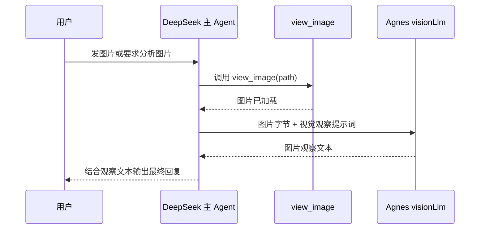

# DeepSeek 执行与 Agnes 视觉观察设计

## 背景

当前项目的图片链路是 `view_image` 下载图片后，通过 `ReactAgentHookService` 把图片字节注入到下一轮执行器模型上下文。这个设计要求执行器模型本身具备视觉能力。

用户期望调整为：

- DeepSeek 负责规划和执行。
- Agnes 负责识图。
- 主 Agent 仍由 DeepSeek 驱动，不让 Agnes 直接成为最终回复模型。

## 目标

引入独立的视觉模型角色 `visionLlm`，让 `view_image` 触发图片观察时调用 Agnes 生成文本观察结果，再把观察结果交给 DeepSeek 继续推理、调用工具或回复用户。

## 非目标

- 不让 Agnes 接管主对话执行。
- 不新增复杂子代理流程。
- 不改变用户调用 `view_image` 的参数协议。
- 不在第一版实现多模型动态路由 UI。

## 模型角色

| 角色 | 推荐模型 | 职责 |
| --- | --- | --- |
| `executorLlm` | DeepSeek | ReAct 执行、工具选择、最终回答 |
| `plannerLlm` | DeepSeek 或沿用执行器 | 任务规划；当前 `AgentPlannerService` 已沿用 `executorLlm` |
| `visionLlm` | Agnes | 图片内容观察，输出给主 Agent 使用的文本观察结果 |

为了避免旧注释误导，正式实现时需要同步清理“执行器 LLM 是 Agnes/DeepSeek”的过期描述，并在 `docs/project-spec.md` 新增或修订 ADR。

## 配置设计

在 `agent.llm` 下新增 `vision` 配置段：

```yaml
agent:
  llm:
    executor:
      api-url: ${DEEPSEEK_LLM_URL:https://api.deepseek.com}
      api-key: ${DEEPSEEK_API_KEY:}
      model: ${DEEPSEEK_LLM_MODEL:deepseek-v4-flash}
      thinking-enabled: false
    vision:
      api-url: ${AGNES_LLM_URL:https://apihub.agnes-ai.com/v1}
      api-key: ${AGNES_API_KEY:}
      model: ${AGNES_LLM_MODEL:agnes-2.0-flash}
```

`vision` 使用通用 OpenAI 兼容请求，不添加 DeepSeek 专有参数。

## 识图行为

保留工具名 `view_image` 和参数：

```json
{
  "path": "/home/gem/uploads/image.png"
}
```

第一版建议把 Agnes 调用放在 `view_image` 后处理链路中：

1. `ViewImageTool` 继续负责从沙箱下载图片。
2. `ImageBuffer` 继续传递图片字节和 MIME 类型。
3. `ReactAgentHookService.viewImageHook()` 不再把图片直接注入主执行器上下文。
4. Hook 调用 `visionLlm`，让 Agnes 生成图片观察文本。
5. Hook 将观察文本作为额外上下文消息注入给 DeepSeek，DeepSeek 再结合原始工具 observation 继续执行。

Agnes 的视觉提示词：

```text
你是视觉观察器。请根据图片内容输出给主 Agent 使用的客观观察结果。
如果用户没有提出具体问题，就概括图片主要内容、可见文字、界面状态和明显细节。
如果用户提出了具体问题，就优先提取与问题相关的信息。
看不清或不确定的内容要明确说明，不要猜测。
只输出观察结果，不要寒暄。
```

## 数据流



## 错误处理

- 图片下载失败：保持当前 `view_image` 错误返回，DeepSeek 决定是否重试或说明问题。
- Agnes 调用失败：返回“图片已加载，但视觉模型暂时无法分析”的 observation，不伪装成成功识图。
- 图片过大或格式不支持：在调用 Agnes 前做大小和 MIME 类型校验，返回明确错误。
- Agnes 输出为空：返回明确 observation，提示主 Agent 不能依赖该图片观察。

## 测试重点

- `view_image` 成功时，DeepSeek 收到的是 Agnes 生成的文本观察，而不是图片 bytes。
- `visionLlm` 使用 Agnes 配置，不读取 DeepSeek 的 `thinking-enabled`。
- DeepSeek 仍是 `executorLlm`，规划和执行不会切回 Agnes。
- Agnes 失败时，主 Agent 能看到失败 observation。
- 纯发图片场景下，Agnes 输出客观描述，DeepSeek 输出面向用户的正常回复。

## 实施顺序

1. 新增 `AgentConfigProperties.Llm.Vision`。
2. 新增 `visionLlm` Bean，使用通用 LLM 实现或轻量专用实现。
3. 让 `ReactAgentHookService` 注入 `visionLlm`，在 `viewImageHook()` 中调用 Agnes。
4. 调整 `application.yml` 默认配置，使 executor 指向 DeepSeek，vision 指向 Agnes。
5. 更新 `docs/project-spec.md` 的 ADR，说明 DeepSeek 与 Agnes 的职责分离。
6. 增加单元测试或集成测试覆盖成功与失败链路。
