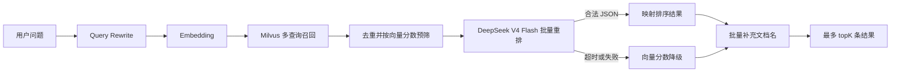

# DeepSeek V4 Flash 知识库重排设计

## 背景

云端知识库检索链路当前使用 Milvus 召回和本地 `BAAI/bge-reranker-v2-m3` 重排。一次真实检索虽然能够命中正确内容，但总耗时约 41.66 秒，其中本地 TEI 重排约 38.84 秒。云服务器只有 2 核 CPU，本地模型的排队和推理时间已经成为主要瓶颈。

同时，现有实现还有两个与模型无关的返回问题：

- `KnowledgeServiceImpl.search` 接收请求级 `topK`，但 `RerankService` 固定使用全局配置中的 `topK=8`，导致请求 `topK=5` 时仍返回 8 条。
- `VectorStoreServiceImpl` 只从 Milvus 返回 `doc_id` 和 `chunk_index`，`KnowledgeServiceImpl` 却从向量结果读取 `docName`，最终返回 `null`。

云端当前主流程配置为 `DEEPSEEK_LLM_MODEL=deepseek-v4-flash`，但后续主流程会独立切换到 Pro。重排不能继承主流程的模型名，必须使用自己的 `RAG_RERANK_MODEL=deepseek-v4-flash`；两者可以复用同一 DeepSeek API 地址和密钥，但修改任一模型名都不能影响另一条链路。

## 目标

- 使用 DeepSeek V4 Flash 对 Milvus 召回候选进行一次批量语义重排。
- 将重排等待时间限制在可控范围内，外部模型异常时不影响知识库基本检索能力。
- 让 Knowledge 页面搜索严格遵守请求级 `topK`。
- 为搜索结果补充真实文档名，不再返回 `docName=null`。
- 保留现有 BGE 实现作为可选提供方，便于未来切换到 GPU 或专用重排服务。
- Agent 自动知识增强和 Knowledge 页面搜索共用同一重排契约与降级规则。
- 后续在 DeepSeek 兼容协议内更换重排模型时，只修改环境变量，不修改 Java 类和调用方。

## 非目标

- 不调整文档上传、解析、切片、Embedding 和 Milvus 数据结构。
- 不改变 Query Rewrite 的行为。
- 不在前端增加模型选择界面。
- 不删除本地 TEI、Adapter 或 BGE 代码；云端服务清理属于部署阶段的独立操作。
- 不要求 LLM 生成自然语言解释，只使用它返回的排序结果。

## 方案选择

### 方案 A：DeepSeek 批量重排，失败时向量降级（采用）

Milvus 先召回候选，将候选编号和文本一次性发送给 DeepSeek。DeepSeek 只返回 JSON 排序结果。调用超时、网络失败、响应为空或 JSON 不合法时，按原始向量分数排序并截取 `topK`。

优点是无需占用云服务器推理资源，能够复用现有 DeepSeek 配置，并且保留确定性的降级路径。代价是每次检索会增加一次外部 API 调用和相应 Token 成本。

### 方案 B：继续使用本地 BGE，缩小候选集

将候选从 20 条降到 8～10 条，并增加超时。改动较小，但 2 核 CPU 上仍可能出现明显排队，无法从根本上消除本地推理资源瓶颈。

### 方案 C：完全关闭重排

直接按 Milvus 向量分数返回。延迟最低、成本最低，但复杂语义问题的排序质量会下降，不符合保留重排能力的目标。

## 总体架构

`RerankService` 继续作为上层唯一依赖，通过配置选择具体实现：

- `provider=deepseek`：使用新的 `DeepSeekRerankServiceImpl`。
- `provider=bge`：使用现有 `BgeRerankServiceImpl`。
- `enabled=false`：不调用外部重排服务，直接按向量分数排序。

上层不感知具体模型、API URL 和厂商请求结构。`KnowledgeServiceImpl` 与 `KnowledgeEnhancerImpl` 仍只调用 `RerankService`；模型名、地址、密钥、超时和候选限制全部封装在重排实现及 `rag.enhancement.rerank` 配置中。

为控制改动范围，本次不重构整个 RAG 调用契约，也不引入通用模型路由框架。只在 Spring Bean 选择边界上隔离 BGE 与 DeepSeek：现有 BGE 实现增加配置条件，新 DeepSeek 实现在 `provider=deepseek` 时生效，保证运行时只有一个 `RerankService` Bean。



## 重排接口设计

为减少连锁修改，保留现有接口不变：

```java
List<RankedChunk> rerank(String query, List<RawChunk> candidates);
```

约束如下：

- `RerankService` 只表达“按查询重排候选”的领域能力，不暴露 DeepSeek、BGE 或具体模型名。
- DeepSeek 与 BGE 实现都使用独立的 RAG 配置 `rag.enhancement.rerank.top-k` 控制默认输出上限。
- `KnowledgeEnhancerImpl` 无需修改，继续使用该默认上限构建 Agent 上下文。
- `KnowledgeServiceImpl.search` 在重排返回后按接口请求的 `topK` 做最终截断，修复请求 5 条却返回 8 条的问题，而不把页面参数扩散到通用重排接口。
- DeepSeek 返回重复、越界或缺失索引时，忽略非法项，并用尚未入选的向量候选补足到配置上限。

## DeepSeek 请求设计

### 专用实现

新增 `DeepSeekRerankServiceImpl`，只负责重排，不复用 `executorLlm` Bean。原因是执行器包含 tool calling、思考模式和 Agent 语义，而重排需要低温度、短输出和严格 JSON，二者生命周期与失败策略不同。以后把主流程从 Flash 改为 Pro，只修改 `DEEPSEEK_LLM_MODEL`；把重排从 Flash 改为其他 DeepSeek 兼容模型，只修改 `RAG_RERANK_MODEL`。

该实现使用 DeepSeek 的 OpenAI 兼容 chat completion 接口，但请求参数独立控制：

- `model`：只读取 `${RAG_RERANK_MODEL:deepseek-v4-flash}`，禁止回退到 `DEEPSEEK_LLM_MODEL`。
- `temperature`：`0`。
- `thinking.type`：`disabled`。
- `max_tokens`：默认 `512`。
- 不发送工具定义，不启用流式响应。
- HTTP 总超时默认 `10` 秒。

### 候选控制

Milvus 的原始召回量维持现有策略，但发送给 DeepSeek 前做一次确定性预筛：

- 按向量分数降序排列。
- 最多发送 `max-candidates` 条，默认 `12`。
- 单条 `content` 最多发送 `max-content-chars` 个字符，默认 `1200`；超出部分截断，不修改数据库原文。
- 候选使用数组位置作为稳定 `index`，不向模型暴露用户 ID、知识库 ID、文件路径或 API 凭据。

### 提示词

系统提示词明确要求模型只做相关性排序：

```text
你是知识库检索重排器。请根据用户查询判断候选片段的语义相关性。
只返回 JSON，不要解释，不要 Markdown，不要补充候选中不存在的内容。
结果按相关性从高到低排列，每个候选最多出现一次。
```

用户消息使用结构化 JSON：

```json
{
  "query": "Java Spring Boot",
  "topK": 5,
  "candidates": [
    {"index": 0, "text": "候选片段一"},
    {"index": 1, "text": "候选片段二"}
  ]
}
```

期望响应：

```json
{
  "results": [
    {"index": 1, "score": 0.96},
    {"index": 0, "score": 0.71}
  ]
}
```

`score` 只用于本次结果展示和排序，不跨查询比较，也不作为新的召回阈值。模型返回的排序次序是主要依据。

## 配置设计

在 `rag.enhancement.rerank` 下扩展配置：

```yaml
rag:
  enhancement:
    rerank:
      enabled: ${RAG_RERANK_ENABLED:true}
      provider: ${RAG_RERANK_PROVIDER:deepseek}
      api-url: ${RAG_RERANK_API_URL:${DEEPSEEK_LLM_URL:https://api.deepseek.com}}
      api-key: ${RAG_RERANK_API_KEY:${DEEPSEEK_API_KEY:}}
      model: ${RAG_RERANK_MODEL:deepseek-v4-flash}
      top-k: ${RAG_RERANK_TOP_K:8}
      max-candidates: ${RAG_RERANK_MAX_CANDIDATES:12}
      max-content-chars: ${RAG_RERANK_MAX_CONTENT_CHARS:1200}
      timeout-seconds: ${RAG_RERANK_TIMEOUT_SECONDS:10}
      max-tokens: ${RAG_RERANK_MAX_TOKENS:512}
```

注意：

- `DEEPSEEK_LLM_MODEL` 只控制主流程模型，`RAG_RERANK_MODEL` 只控制重排模型，二者没有模型名回退关系。
- `top-k` 是重排服务和 Agent 自动增强的默认上限；Knowledge 搜索接口在服务返回后按请求 `topK` 再截断。
- DeepSeek API Key 只从环境变量读取，不写入仓库。
- 选择 `provider=bge` 时，将 `RAG_RERANK_API_URL` 指向现有 BGE Adapter；BGE 实现忽略 API Key、模型名和 DeepSeek 请求参数。

## 文档名修复

文档名不属于 Milvus 向量结果。`KnowledgeServiceImpl.search` 在得到去重后的 `docIds` 后，应使用 `KnowledgeDocumentRepository.findAllById(docIds)` 一次批量查询文档实体，构建 `docId -> fileName` 映射。

返回规则：

- 查到文档时返回真实 `fileName`。
- 文档已删除或元数据缺失时返回“未知文档”，不得返回 `null`。
- 不为每个结果单独查询数据库，避免 N+1。

Agent 路径现有的 `KnowledgeEnhancerImpl.enrichWithDocName` 继续保留，并与上述缺失值规则保持一致。

## 错误处理与降级

以下情况触发向量排序降级：

- DeepSeek HTTP 连接失败、非 2xx 响应或总耗时超过配置超时。
- 响应为空、缺少 `results`、不是合法 JSON。
- 所有返回索引都重复、越界或无法映射到候选。
- 模型返回数量不足时，先保留合法重排项，再按原向量分数补足到 `topK`。

重排失败属于可恢复故障：记录 `WARN`，包含 provider、model、候选数、topK、耗时和降级原因，不记录查询全文、候选正文、API Key 或完整响应。降级成功后正常返回检索结果；只有向量检索本身失败时才继续遵循现有上层异常策略。

## 可观测性

每次重排记录一条结构化日志：

```text
重排完成: provider=deepseek, model=deepseek-v4-flash, candidates=12, topK=5, elapsedMs=1840, fallback=false
```

降级日志示例：

```text
重排降级: provider=deepseek, candidates=12, topK=5, elapsedMs=10007, reason=timeout
```

不得记录用户原始问题、候选正文和模型原始响应，避免知识库内容进入日志。

## 测试设计

### `DeepSeekRerankServiceImpl` 单元测试

- 合法 JSON 响应能够按模型顺序映射回原始 `RawChunk`。
- `topK=5` 时最多返回 5 条。
- 重复索引和越界索引被忽略。
- 响应不足时按向量分数补足，且不重复。
- HTTP 超时、非 2xx、空响应和非法 JSON 均降级为向量排序。
- 候选超过限制时只发送向量分数最高的 `max-candidates` 条。
- 请求明确关闭 thinking，且不包含工具定义。

### 调用方测试

- `KnowledgeServiceImpl.search(..., topK=5)` 最终只返回 5 条。
- Knowledge 搜索结果能够批量补充真实文档名，元数据缺失时返回“未知文档”。
- `KnowledgeEnhancerImpl` 无需修改，继续使用重排服务的配置默认上限。
- `provider=deepseek` 和 `provider=bge` 时只创建一个 `RerankService` Bean。
- `enabled=false` 时不发起外部调用。
- 将主流程模型配置改为 Pro 时，DeepSeek 重排请求仍使用 `RAG_RERANK_MODEL=deepseek-v4-flash`。

### 云端验证

- 使用现有知识库执行与本次诊断相同的查询，确认 HTTP 200、命中内容合理、返回数量等于请求 `topK`、`docName` 非空。
- 连续执行至少 3 次，记录端到端耗时和重排耗时；验收目标为单次不超过配置的 10 秒超时，超时时能够返回向量降级结果。
- 临时模拟错误模型名或不可达地址，确认请求不会无限等待，并在超时后正常返回向量结果。
- 验证云端不再依赖本地 TEI 后，再单独决定是否停用 `webagent-rerank-adapter` 和 `webagent-reranker-tei`，不得在代码部署前提前删除服务。

## 预计改动范围

- `src/main/java/com/example/sandbox/web/service/enhance/impl/DeepSeekRerankServiceImpl.java`
- `src/main/java/com/example/sandbox/web/service/enhance/impl/BgeRerankServiceImpl.java`
- `src/main/java/com/example/sandbox/web/config/RagConfigProperties.java`
- `src/main/java/com/example/sandbox/web/service/impl/KnowledgeServiceImpl.java`
- `src/main/resources/application.yml`
- 对应单元测试文件
- `docs/project-spec.md` 第八章新增 ADR，记录“RAG 重排采用可切换提供方，外部失败退化为向量排序”的决策

## 实施约束

- 所有新增类、字段、方法及错误重试/降级注释使用中文，并说明职责、参数、返回值和异常行为。
- 不覆盖当前工作区中与本任务无关的未提交修改，尤其是已有的 `application.yml` 和 `docs/project-spec.md` 变化。
- 不修改主流程 LLM 的 Bean、接口或调用链；主流程模型切换只属于其自身配置。
- 不新增通用模型注册中心、动态路由器或多层抽象；当前 `RerankService` 已经是足够的解耦边界。
- 第一版不加入自动重试。重排位于用户请求关键路径，失败后立即降级比重复等待更安全。
- 不提交或打印 DeepSeek API Key。
- 设计批准后先编写失败测试，再实现最小改动，最后执行本地测试、构建和云端真实检索验证。
