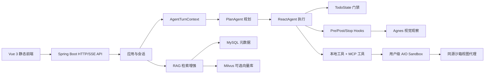

# WebAgent Clean 项目入口

WebAgent Clean 是一个基于 Spring Boot 的多用户智能体平台。当前主线把 [[Agent 编排模块]]、[[工具系统模块]]、[[Skill 系统模块]]、[[RAG 知识库模块]]、[[文件与工作区模块]]、[[Sandbox 模块]] 和静态 Vue 前端组合成一个可通过网页使用的 Agent 工作台。系统的核心价值是：用户在会话中发起任务，后端完成规划、ReAct 工具执行、知识库增强、沙箱文件操作、浏览器观察和结果交付。

## 给 AI 的最短阅读路径

1. 先读 [[01 当前上下文]]，确认当前分支、未提交改动和最近完成的大能力。
2. 再读 [[系统边界]]、[[系统运行方式]] 和 [[技术栈与外部依赖]]，建立后端、前端、沙箱和外部服务边界。
3. 改 Agent 执行链路时读 [[Agent 编排模块]]、[[计划与 ReAct 执行]]、[[Agent 工具调用]]、[[工具系统模块]] 和 [[工具目录]]。
4. 改文件、工作区或预览时读 [[文件与工作区模块]]、[[Office 文件预览]]、[[文件上传与预览]] 和 [[前端模块]]。
5. 改沙箱 HTTP、同源视图或 WebSocket 代理时读 [[Sandbox 模块]]、[[AIO Sandbox 客户端]]、[[用户 Sandbox 创建与恢复]] 和 [[AIO Sandbox REST 契约]]。
6. 改知识库检索时读 [[RAG 知识库模块]]、[[文档摄取与切片]]、[[查询改写与重排]] 和 [[知识库文档上传与检索]]。
7. 准备简历和面试时读 [[项目面试学习路线]]。

## 人类浏览入口

- 架构：[[系统边界]] · [[系统运行方式]] · [[技术栈与外部依赖]]
- Agent：[[Agent 编排模块]] · [[计划与 ReAct 执行]] · [[LLM 接入与错误处理]] · [[创建会话并完成一次对话]] · [[Agent 工具调用]]
- 工具与扩展：[[工具系统模块]] · [[工具目录]] · [[浏览器工具]] · [[文件与文档工具]] · [[Skill 与知识检索工具]] · [[Skill 系统模块]]
- 执行基础设施：[[Sandbox 模块]] · [[AIO Sandbox 客户端]] · [[用户 Sandbox 创建与恢复]]
- 内容与文件：[[文件与工作区模块]] · [[Office 文件预览]] · [[文件上传与预览]]
- RAG：[[RAG 知识库模块]] · [[文档摄取与切片]] · [[查询改写与重排]] · [[知识库文档上传与检索]]
- 接口与数据：[[后端 HTTP API]] · [[核心数据模型]] · [[运行配置]] · [[AIO Sandbox REST 契约]]
- 产品接入层：[[前端模块]] · [[认证与用户模块]] · [[Agent 应用与会话模块]]
- 工程状态：[[测试现状]] · [[当前已知风险]] · [[待确认问题]] · [[项目面试学习路线]]
- 记录与临时归档：[[变更 2026-06-13 初始知识库]] · [[变更 2026-07-06 面试前知识库同步]] · [[收件箱]]

## 当前系统主干

## 使用约定

- `status: verified`：可从当前源码、配置、测试或权威契约直接确认。
- `status: inferred`：根据当前实现和产品目标推断，仍需要运行验证或面试表达取舍。
- `status: stale`：已知可能落后于代码，不应直接用于决策。
- 页面中的源码路径均相对于仓库根目录 `D:\javademo\webagent-clean`。
- Obsidian 是项目知识库的正式存储位置，仓库内 `docs/project-spec.md` 是规范和 ADR 来源，不是知识库镜像。