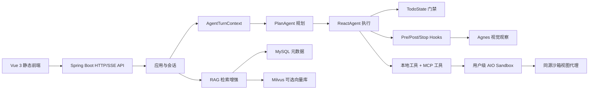

# WebAgent Clean 项目入口

## 1. 快速结论

- WebAgent Clean 是一个 Spring Boot 单体应用，前端静态页面、HTTP API、SSE、沙箱视图代理都由同一服务提供。
- 核心能力由 [[Agent 编排模块]]、[[工具系统模块]]、[[Skill 系统模块]]、[[RAG 知识库模块]]、[[文件与工作区模块]] 和 [[Sandbox 模块]] 组成。
- 用户侧主流程是：创建会话 → 复用或创建用户级 Sandbox → 发送消息 → 规划 → ReAct 执行工具 → 返回结果。
- 知识库、会话、应用、用户、沙箱绑定等元数据存 MySQL；向量检索依赖 Milvus，但默认可关闭。
- 改代码前先看 `docs/project-spec.md`，新增架构决策需要补 ADR。

## 2. 项目定位

WebAgent Clean 是一个多用户智能体工作台。用户在网页里发起任务，后端负责规划、工具执行、知识库增强、沙箱文件操作、浏览器观察和结果交付。

系统不是单纯聊天应用，也不是单独的沙箱代理；它的边界更接近“带持久会话、用户工作区、可扩展工具和可选 RAG 的 Agent 平台”。

## 3. 入口路径

### 3.1 给 AI 的最短阅读路径

1. 先读 [[01 当前上下文]]，确认当前分支、未提交改动和最近完成的大能力。
2. 再读 [[系统边界]]、[[系统运行方式]] 和 [[技术栈与外部依赖]]，建立后端、前端、沙箱和外部服务边界。
3. 改 Agent 执行链路时读 [[Agent 编排模块]]、[[计划与 ReAct 执行]]、[[Agent 工具调用]]、[[工具系统模块]]、[[工具目录]] 和 [[子代理与后台任务]]。
4. 改文件、工作区或预览时读 [[文件与工作区模块]]、[[Office 文件预览]]、[[文件上传与预览]] 和 [[前端模块]]。
5. 改沙箱 HTTP、同源视图或 WebSocket 代理时读 [[Sandbox 模块]]、[[AIO Sandbox 客户端]]、[[用户 Sandbox 创建与恢复]] 和 [[AIO Sandbox REST 契约]]。
6. 改知识库检索时读 [[RAG 知识库模块]]、[[文档摄取与切片]]、[[查询改写与重排]] 和 [[知识库文档上传与检索]]。

### 3.2 人类浏览入口

- 架构：[[系统边界]] · [[系统运行方式]] · [[技术栈与外部依赖]]
- Agent：[[Agent 编排模块]] · [[计划与 ReAct 执行]] · [[子代理与后台任务]] · [[LLM 接入与错误处理]] · [[创建会话并完成一次对话]] · [[Agent 工具调用]]
- 工具与扩展：[[工具系统模块]] · [[工具目录]] · [[浏览器工具]] · [[文件与文档工具]] · [[Skill 与知识检索工具]] · [[Skill 系统模块]]
- 执行基础设施：[[Sandbox 模块]] · [[AIO Sandbox 客户端]] · [[用户 Sandbox 创建与恢复]]
- 内容与文件：[[文件与工作区模块]] · [[Office 文件预览]] · [[文件上传与预览]]
- RAG：[[RAG 知识库模块]] · [[文档摄取与切片]] · [[查询改写与重排]] · [[知识库文档上传与检索]]
- 接口与数据：[[后端 HTTP API]] · [[核心数据模型]] · [[运行配置]] · [[AIO Sandbox REST 契约]]
- 工程状态：[[测试现状]] · [[当前已知风险]] · [[待确认问题]]

## 4. 当前系统主干

## 5. 核心模块速查

| 模块 | 主要职责 | 优先阅读 |
| --- | --- | --- |
| Agent 编排 | 会话消息转为规划、执行、保存和 token 记录 | [[Agent 编排模块]] · [[子代理与后台任务]] |
| 工具系统 | 把本地工具、MCP 工具暴露给 ReAct 执行器 | [[工具系统模块]] |
| Sandbox | 创建、复用、恢复用户级 AIO Sandbox，并代理视图 | [[Sandbox 模块]] |
| RAG | 知识库、文档摄取、切片、Embedding、检索增强 | [[RAG 知识库模块]] |
| 文件与工作区 | 上传文件、工作区同步、Office 预览 | [[文件与工作区模块]] |
| 前端 | Vue 静态工作台，承载 Chat、Knowledge、Skills、MCP 等页面 | [[前端模块]] |

## 6. 使用约定

- `status: verified`：可从当前源码、配置、测试或权威契约直接确认。
- `status: inferred`：根据当前实现和产品目标推断，仍需要运行验证。
- `status: stale`：已知可能落后于代码，不应直接用于决策。
- 页面中的源码路径均相对于当前仓库根目录。
- Obsidian 是项目知识库的正式存储位置，`docs/project-spec.md` 是规范和 ADR 来源。

## 7. 排查入口

| 问题 | 优先看哪里 |
| --- | --- |
| 对话没有流式返回 | [[系统运行方式]]、[[Agent 编排模块]]、[[后端 HTTP API]] |
| 工具没被调用或结果异常 | [[Agent 工具调用]]、[[工具系统模块]]、[[工具目录]] |
| 沙箱打不开或视图 502 | [[Sandbox 模块]]、[[AIO Sandbox 客户端]] |
| 知识库上传后检索不到 | [[RAG 知识库模块]]、[[文档摄取与切片]] |
| 文件预览失败 | [[文件与工作区模块]]、[[Office 文件预览]] |
